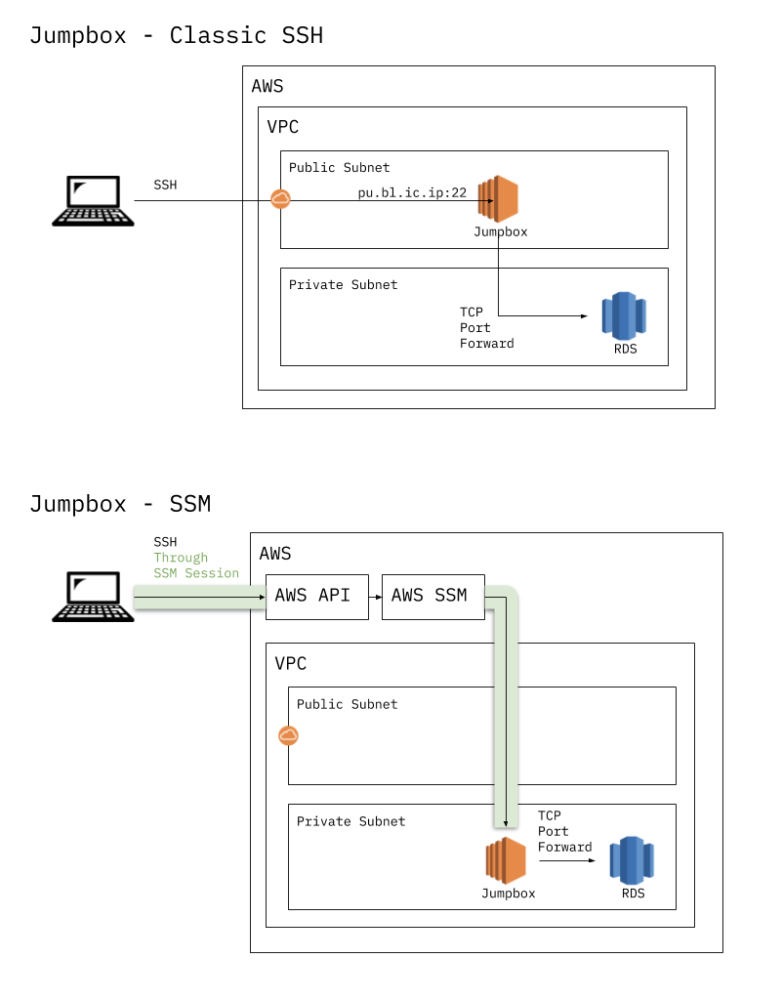
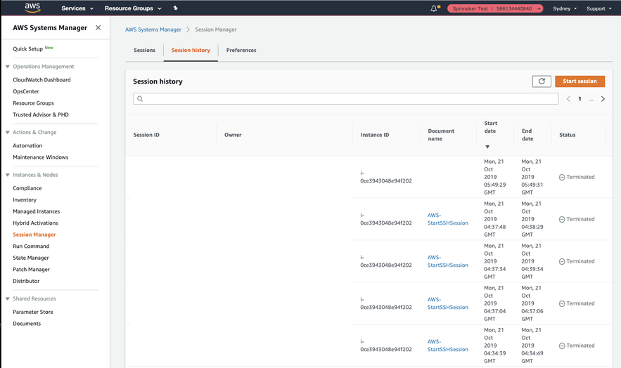

# AWS SSM SSH ProxyCommand

Easy SSH sessions over SSM

  - Install & configure prerequisites for itself with as little user interaction as possible
  - Be used as an [SSH ProxyCommand](https://man.openbsd.org/ssh_config.5#ProxyCommand), in order to easily SSH to an EC2 Instance (via SSM)

Once you're connected with SSH you can do all normal SSH things
- Port forwarding e.g. to RDS - most useful since [SSM does not yet natively support port forwarding to a non-local IP, see GitHub issue 208](https://github.com/aws/amazon-ssm-agent/issues/208)
- [SCP](https://en.wikipedia.org/wiki/Secure_copy) to copy files (also not yet natively supported by SSM)
- [SOCKS Proxy](https://www.digitalocean.com/community/tutorials/how-to-route-web-traffic-securely-without-a-vpn-using-a-socks-tunnel)
- Interactive Bash Terminal etc.

Should work for Windows (with WSL), OSX & Linux clients



# Quick Install

After you have briefly reviewed the script for malicious code, execute it like so:

`curl -s 'https://raw.githubusercontent.com/intelematics/aws-ssm-ssh-proxycommand/master/aws-ssm-ssh-proxycommand.sh' | bash`

# Usage

Once Jumpboxes are set up in your environment, and your client is set up with this script, you will be able to simply and securely start an SSH session to EC2 instances using their instance IDs e.g. `ssh ubuntu@i-xxxxxxxx`

If your jumpbox instance is named `jumpbox`, you can do just `ssh jumpbox` and the script will find that instance and connect.

## Usage Examples

Goal|Command
-|-
Port forward to RDS | `ssh -N -L 1433:tsh.cunh7nydpqk3.ap-southeast-2.rds.amazonaws.com:1433 ubuntu@jumpbox`
Port forward to a private ALB | `ssh -N -L 8443:wso2-analytics-lb-96ed1e73216b9ef5.elb.ap-southeast-2.amazonaws.com:443 ubuntu@jumpbox`
SOCKS Proxy over SSH | `ssh -N -D 31337 i-0ce3943048e94f202`
| `ssh -N -D 31337 jumpbox`


## Jumpboxes Requirements

- Have the [SSM Agent](https://docs.aws.amazon.com/systems-manager/latest/userguide/ssm-agent.html) installed (comes preinstalled on all Intelematics SOE AMIs, and all Amazon Linux AMIs)

- Have an Instance Profile that contains policy
    [AmazonSSMManagedInstanceCore](https://console.aws.amazon.com/iam/home?#/policies/arn:aws:iam::aws:policy/AmazonSSMManagedInstanceCore) `arn:aws:iam::aws:policy/AmazonSSMManagedInstanceCore`

- Permit outbound traffic to either
  - Internet & [SSM Service Endpoint](https://docs.aws.amazon.com/general/latest/gr/ssm.html) **or**
  - [SSM VPCE that you optionally set up to keep traffic within your VPC](https://docs.aws.amazon.com/systems-manager/latest/userguide/setup-create-vpc.html) (so the agent can phone home)

### Highly Recommended Jumpbox Config

- Be in private subnets (no ingress from public internet) and
- Deny all inbound traffic

## Ensuring SSM Agent is the Latest Version

Create an [SSM Association](https://docs.aws.amazon.com/systems-manager/latest/userguide/sysman-state-assoc.html) to regularly update the SSM Agent on all managed instances, every Sunday @ 2am

`aws ssm create-association --name AWS-UpdateSSMAgent --schedule-expression "cron(0 2 ? * SUN *)" --targets Key=instanceids,Values='*'`

Or via Terraform, create an association for continuous auto-updates

1. Get ref to the `AWS-UpdateSSMAgent` document https://www.terraform.io/docs/providers/aws/d/ssm_document.html
1. Create the Association
https://www.terraform.io/docs/providers/aws/r/ssm_association.html

## Security and Access Control
With SSM, security now becomes controlled via IAM policy allowing a Role the ability to execute SSM Documents.

Initial (easy) implementation might give all Developers SSM:* on all EC2 instances.

### Advanced Security and Access Control

You may then want to lock this down further (which would be needed in order to pass an AWS Well Architected Review), to limit the instances to which Developers can connect, by putting a Condition in the policy.

In general, this approach:

Tag instances that should be accessible as SSM Jumpboxes with SSM-Jumphost = True

Deny management of such tags to non-administrative/provisioning users
In an IAM policy, an explicit deny trumps any allows
Apply an accompanying IAM Policy to all IAM Roles requiring access

Example IAM Policy that permits SSM commands only to instances so-tagged, and restricts management of this Tag:

```json
{
    "Version": "2012-10-17",
    "Statement": [
        {
            "Effect": "Allow",
            "Action": [
                "ec2:DescribeInstances"
            ],
            "Resource": "*"
        },
        {
            "Effect": "Allow",
            "Action": [
                "ssm:SendCommand",
                "ssm:StartSession"
            ],
            "Resource": "arn:aws:ec2:*:*:instance/*",
            "Condition": {
                "StringLike": {
                    "ssm:resourceTag/SSM-Jumphost": "True"
                }
            }
        },
        {
            "Effect": "Allow",
            "Action": [
                "ssm:SendCommand",
                "ssm:StartSession"
            ],
            "Resource": [
                "arn:aws:ssm:*::document/AWS-RunShellScript",
                "arn:aws:ssm:*::document/AWS-StartSSHSession"
            ]
        },
        {
            "Effect": "Deny",
            "Action": [
                "ec2:DeleteTags",
                "ec2:CreateTags"
            ],
            "Resource": "*",
            "Condition": {
                "ForAllValues:StringEquals": {
                    "aws:TagKeys": "SSM-Jumphost"
                }
            }
        }
    ]
}
```

# Auditing

CloudTrail obviously but also via SSM



This can also go to CloudWatch logs and s3

# F.A.Q.s
**Q**: Does this work for MS Remote Desktop (RDP)?

**A**:  Yes you can forward port 3389 with e.g. ssh -N -L 3389:windows-hostname:3389 i-xxjumpboxxx


**Q**: Why SSH? (via SSM)

**A**: Standard way for port fwd, proxyjump, SOCKS proxy etc

Simple & standard to implement

AWS-documented and supported
https://docs.aws.amazon.com/systems-manager/latest/userguide/session-manager-getting-started-enable-ssh-connections.html

Can scp (can’t with just SSM)

# Troubleshooting

Problem|Solution
-|-
SSM doesn’t work at all - including web console | Confirm security groups allow SSM connection, and confirm the ec2 instance profile has required IAM policy
|Confirm the role you’re logged into console with has permission to access SSM
|Confirm the instance can reach the SSM endpoint (I had issues reaching boxes in a public subnet)
SSM works in console, but you get something like ```An error occurred (InvalidInstanceId) when calling the SendCommand operation: An error occurred (TargetNotConnected) when calling the StartSession operation: <i-someinstanceID> is not connected.```| Confirm the region you are logging in as. If not explicitly specified, the aws cli will pull the default from ~/.aws/config (which might result in trying to talk to a different/nonexistent instance)
SSM Connects, SSH Can’t auth|Check the SSH user you’re authenticating as; the scripts above use `ec2-user` which is the user for Amazon Linux. If you’re using ubuntu, the user is `ubuntu`
SSM Connects, SSH Connects, but port forwarding hangs|If running `ssh -vvv` you’ll see something like: `OpenSSH_7.9p1, LibreSSL 2.7.3 debug1: Reading configuration data /Users/xxx/.ssh/config debug1: /Users/xxx/.ssh/config line 1: Applying options for * debug1: Reading configuration data /etc/ssh/ssh_config debug1: /etc/ssh/ssh_config line 48: Applying options for * debug1: Executing proxy command: exec aws ssm start-session --target ‘i-xxx         --document-name ‘AWS-StartSSHSession’ debug1: identity file /Users/xxx/.ssh/id_rsa type 0 debug1: identity file /Users/xxx/.ssh/id_rsa-cert type -1 debug1: Local version string SSH-2.0-OpenSSH_7.9 debug1: ssh_exchange_identification: debug1: ssh_exchange_identification: Starting session with SessionId: xxx@xxx.com-xxx debug1: ssh_exchange_identification: \033[?1034hsh-4.2$ \033[Ksh-4.2$ SSH-2.0-OpenSSH_7.9 debug1: ssh_exchange_identification: sh: SSH-2.0-OpenSSH_7.9: command not found debug1: ssh_exchange_identification: sh-4.2$` **This is most likely due to the SSM Agent being out of date**


Further doco at the top of [the script](aws-ssm-ssh-proxycommand.sh)
